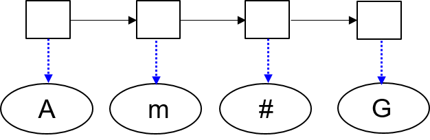
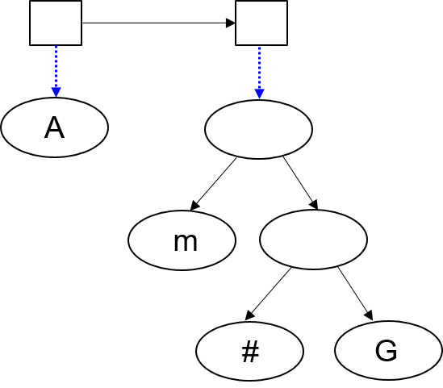
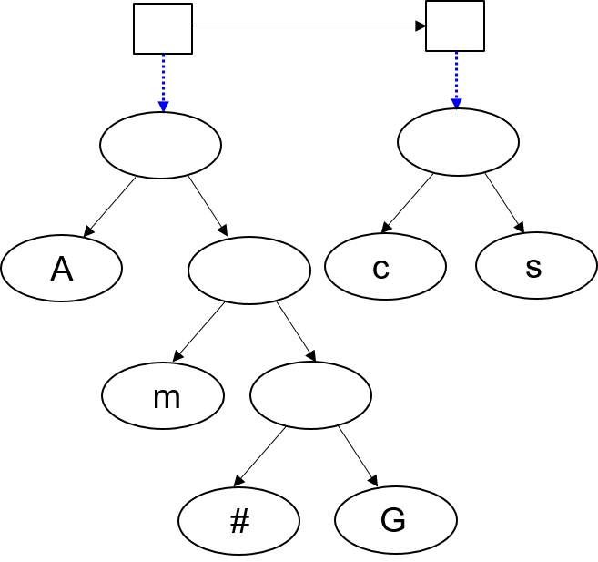

# Build Huffman Code Book from Post-Order Description

Learning Goals
==============

* Understand Huffman Compression

* Understand the description of the compression tree using post-order description

Post-Order Description of Huffman Compress Tree
===============================================

The compression tree can be expressed by post-order traversal.  When a
leaf node is encountered, 1 is printed before printing the character
stored in the node. When a non-leaf node is encountered, 0 is printed.
If the tree has `n` leaf nodes, the tree has `n-1` non-leaf nodes.
Thus, there are `n` 1 printed (not counting the characters) and `n-1`
0 printed.  A final 0 is added to indicate the end of the description.

To rebuild the compression tree, we need to separate the control
from the data. Consider this example:


Control or Data | C | D | C | D | C | D | C | D  
----------------|---|---|---|---|---|---|---|---
Input           | 1 | A | 1 | m | 1 | # | 1 | G

When control `1` is seen, the next must be data. Create a tree node to
hold the data and append the node to the end of a list.  The input so
far should produce the following list of four tree nodes:



When control `0` is seen, take the latest two tree nodes and make them the left and right child of a new tree
node. Insert this tree node back to the list.

The following input 

Control or Data | C | D | C | D | C | D | C | D | C | C 
----------------|---|---|---|---|---|---|---|---|---|---
Input           | 1 | A | 1 | m | 1 | # | 1 | G | 0 | 0

will create this result:



The following input 

Control or Data | C | D | C | D | C | D | C | D | C | C | C | C | D | C | D | C
----------------|---|---|---|---|---|---|---|---|---|---|---|---|---|---|---|---
Input           | 1 | A | 1 | m | 1 | # | 1 | G | 0 | 0 | 0 | 1 | c | 1 | s | 0

will create this result:



The following input 

Control or Data | C | D | C | D | C | D | C | D | C | C | C | C | D | C | D | C | C | C
----------------|---|---|---|---|---|---|---|---|---|---|---|---|---|---|---|---|---|---
Input           | 1 | A | 1 | m | 1 | # | 1 | G | 0 | 0 | 0 | 1 | c | 1 | s | 0 | 0 | 0

will create this result:


Please check the `inputs` directory for sample inputs.  Please notice
that the input does *not* have space or new line separating them. This
requirement allows space or new line to be part of the data.

You can assume that the input is a valid post-order traversal of a
Huffman compression tree.  Your program does not need to check whether
the input is valid.

Your Program's Output
=====================

Your program will the characters, its ASCII value (in decimal), and the codes 

```
A 65 00
m 109 010
# 35 0110
G 71 0111
c 99 10
s 115 11
```

The order of your output does not matter because the output will be sorted before comparison with
the expected output.

Submission
==========

Please submit all necessary files. These are the requirements:

* You must include `Makefile`. Without `Makefile`, it is not possible building your program.

* The executable must be called `hw17` and must not be called anything else.

* Your program should take one argument (`argv[1]`) as the input file name.

* The program's output should be printed to the computer screen (using
  `printf`). The output will be redirected to a file, sorted, and
  compared with the expected output.

* Your program must not have any unwanted output. Unwanted output will
  be treated as errors.

Upload a zip file to Brightspace.

